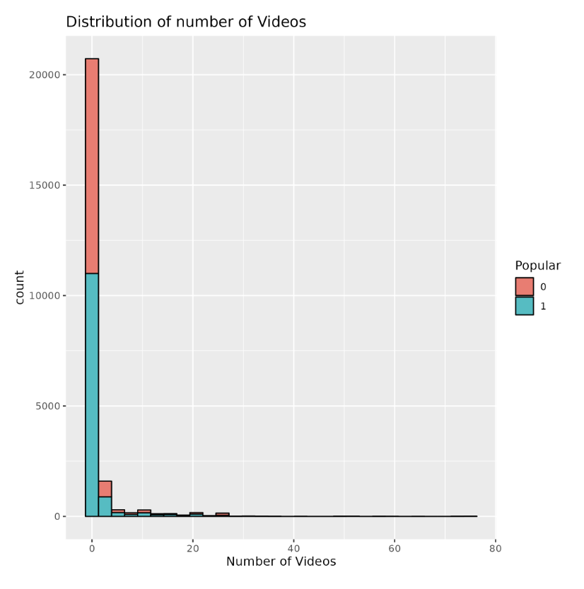

```{r, include = FALSE}
knitr::opts_chunk$set(
  collapse = TRUE,
  comment = "#>"
)
```

```{r setup}
library(dsci310utils)
```

# Introduction to the dsci310utils package

This vignette provides an introduction to the `dsci310utils` R package.

## Installation

Please note that you will first need to install the devtools package if it is not already installed.

You can install the development version of this package from GitHub for use in your project:

```{r}
install.packages("devtools")
devtools::install_github("DSCI-310-2024/dsci310_utils")
```

## Usage
The package provides several functions for data manipulation.

#### Function 1: make_histogram()
This function creates histograms based on input data. Function specific documentation can be accessed in R/histograms.R
Here's how you can use it:

1. Load the package
```{r}
library(dsci310utils)
```

2. Use make_histogram()
```{r}
histogram <- make_histogram(data_frame, xvar, yvar, hist_title, xlabel)
```
Notes:
- data_frame should be a dataframe with at least 1 row, xvar and yvar should be valid column names
in data_frame, and hist_title and x_label should be valid strings. The following inputs must be passed as strings: 
xvar, yvar, hist_title, xlabel. 
- This function always fills the histograms based on the value of the variable "Popular". 
Therefore "Popular" must be a valid column in data_frame. 
This can easily be adjusted by changing the "fill" argument on line 51 in R/histograms.R if need be.

ADD INSTRUCTIONS FOR OTHER FUNCTIONS HERE!!!

Here's a simple example demonstrating how to use my_package:

```{r}
# Load the package
library(dsci310utils)

# Create sample data frame

good_df <- data.frame( 
    shares = c(593, 711, 1500),
    num_hrefs = c(4, 3, 3),
    num_imgs = c(1, 1, 1),
    num_videos = c(0, 0, 0))

# Use make_histogram()
histogram <- make_histogram(good_df, "num_videos", "shares", 
                            "Distribution of number of number of Videos",
                             "Number of Videos")

# Create a confusion matrix
temp_dir <- tempdir()
create_conf_mat_summary(TP = 100, FP = 10, FN = 5, TN = 85, output_directory = temp_dir)                         
```

The histogram output on running the above code will look like this:


